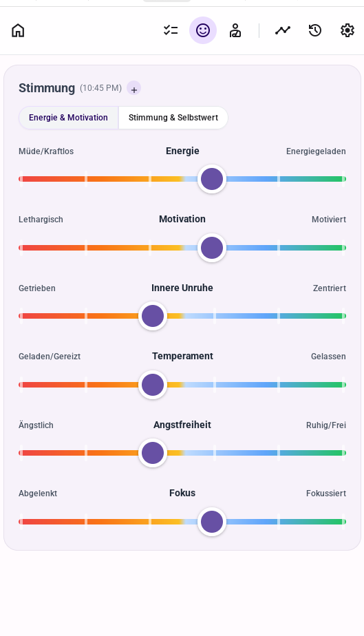
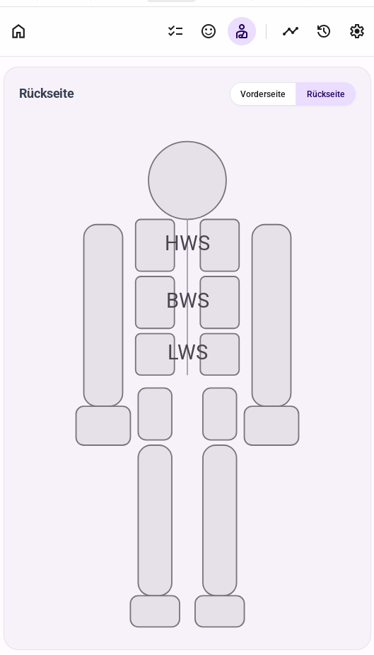
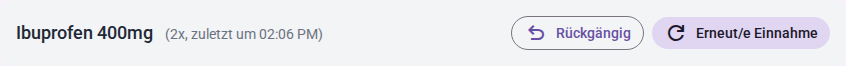
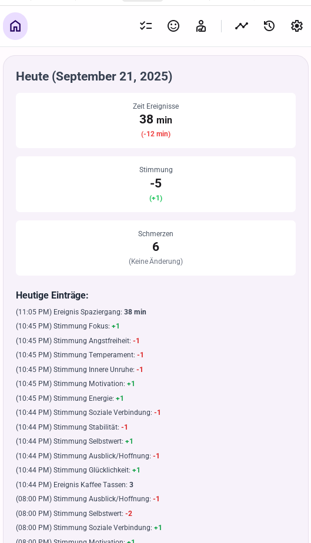
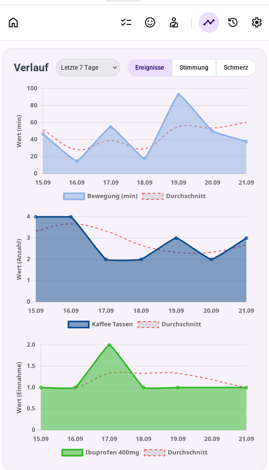
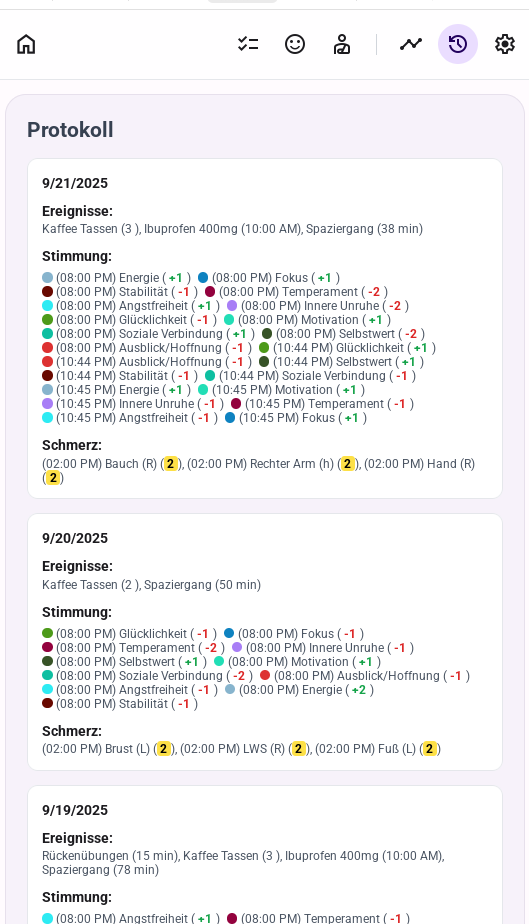
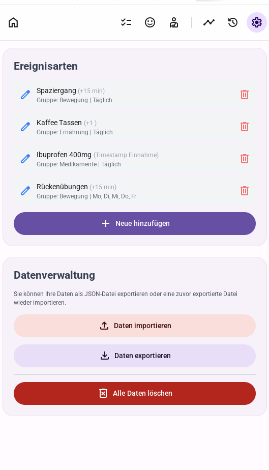
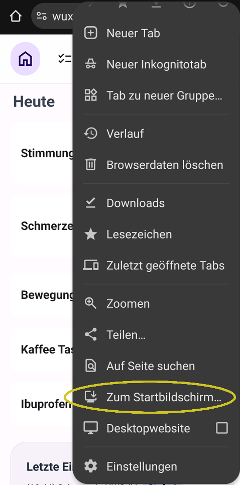

# **WellTrack Gesundheitstagebuch**

**[Hier klicken , um WellTrack (mit Updates) im Browser zu nutzen](https://wuxxin.github.io/welltrack/welltrack/welltrack.html)**

WellTrack ist ein persönliches und 100 % privates Gesundheitstagebuch, das dabei hilft, Zusammenhänge zwischen Gewohnheiten, dem eigenen Befinden und der allgemeinen Gesundheit zu erkennen.

Als offline-fähige Progressive Web App (PWA) bleiben dabei alle Daten ausschließlich auf dem eigenen Gerät – es gibt keinen Server und keine Cloud. Das ermöglicht vollständige Kontrolle und eine schnelle Nutzung, auch ohne Internetverbindung und auf jedem beliebigen Gerät.

## Funktionsumfang

**Der Schwerpunkt der App liegt in der schnellen, einfachen aber detaillierte Datenerfassung von Schmerz, Stimmung und anderen Ereignissen.**

### Stimmung protokollieren

Eine detaillierte Erfassung der Stimmung dauert weniger als 30 Sekunden. Die Verwendung von Werten wie -3, -2, -1, +1, +2, +3 ohne eine neutrale Null ermöglicht eine feine Kalibrierung. Dies macht das separate Ausfüllen einzelner Stimmungswerte überflüssig, da alle eingetragenen Werte ungleich Null sind, während fehlende Werte als Null interpretiert werden, ohne das Ergebnis zu verfälschen.

Die Stimmung kann mithilfe intuitiver Schieberegler für verschiedene Aspekte wie Energie, Motivation und Angstfreiheit erfasst werden. Die Stimmungen sind in Gruppen organisiert, um die Eingabe zu vereinfachen.

### Schmerzen protokollieren

Die Schmerzeintragung ist schnell und dennoch detailliert. Durch die Reduzierung auf eine Skala von 0-5 (0=kein, 1=leicht, 2=unangenehm, 3=stark, 4=fürchterlich, 5=vernichtend) mit klaren, nachlesbaren Definitionen wird eine eindeutige Kategorisierung der Schmerzintensität ermöglicht. Fehlende Werte werden als 0 behandelt, was zu einem aussagekräftigen Teilergebnis führt.

### Ereignisse eintragen

Tägliche Aktivitäten wie Spaziergänge oder der Kaffeekonsum können als kumulative Werte (z.B. "60 min") erfasst werden. Die Ereignistypen lassen sich in den Einstellungen vollständig anpassen.

Für schnelle, wiederholbare Aktionen wie die Einnahme von Medikamenten gibt es "PushButton"-Ereignisse. Ein Klick erfasst das Ereignis mit einem Zeitstempel. Nach der Erfassung erscheinen Optionen, um die Eingabe rückgängig zu machen oder das Ereignis erneut zu erfassen, was ideal für die Protokollierung von mehreren Dosen ist.

### Tagesübersicht

Die Startseite bietet eine Zusammenfassung des aktuellen Tages, einschließlich der wichtigsten Werte für Stimmungen und Schmerzen im Vergleich zum Vortag. Darunter befindet sich ein detailliertes Protokoll aller heutigen Einträge.

### Verlaufs-Diagramme

Die gesammelten Daten lassen sich in übersichtlichen Diagrammen visualisieren. Trends für Ereignisse, Stimmungen und Schmerzen können über verschiedene Zeiträume (1 Woche, 1 Monat, 6 Monate) analysiert werden.

### Detailliertes Protokoll

Ein chronologisches und paginiertes Protokoll aller Einträge, gruppiert nach Tagen.

## Einstellungen

### Ereignissarten bearbeiten

Ereignisarten können angepasst

### Daten Import & Export
Daten durch Import/Export einer JSON-Datei verwaltet werden.

### Optionale Erinnerungen

WellTrack bietet optional anpassbare Erinnerungen. In den Einstellungen können Browser-Benachrichtigungen aktiviert und mehrere Erinnerungszeiten (z.B. "12:00, 18:00") festgelegt werden, um sicherzustellen, dass keine Einträge vergessen werden.

## Nutzung & Installation

Die einfachste Methode, WellTrack zu nutzen, ist über die gehostete Version, die immer auf dem neuesten Stand ist:

**[Klicken Sie hier, um WellTrack zu starten](https://wuxxin.github.io/welltrack/welltrack/welltrack.html)**

### Installation auf dem Smartphone

Für ein App-ähnliches Erlebnis kann WellTrack auf dem Smartphone-Startbildschirm installiert werden.

1. WellTrack im mobilen Browser (z.B. Chrome oder Safari) öffnen.
2. Das Browser-Menü öffnen (oft durch drei Punkte oder ein Teilen-Symbol dargestellt).
3. Die Option **"Zum Startbildschirm hinzufügen"** (oder eine ähnliche Formulierung) wählen.

Danach erscheint ein WellTrack-Symbol auf dem Startbildschirm, über das die App wie eine native Anwendung gestartet werden kann.

### Lokale Nutzung auf dem Laptop/PC

Alternativ kann die `welltrack.html`-Datei direkt auf einem Computer gespeichert und im Browser geöffnet werden.
**Hinweis:** Bei dieser Methode muss die Datei manuell aktualisiert werden, um neue Funktionen und Fehlerbehebungen zu erhalten.

## Technische Merkmale

* **Progressive Web App (PWA):** Kann wie eine native App auf einem Gerät "installiert" werden und funktioniert offline.
* **Single-Page-Anwendung (SPA):** Die gesamte Anwendung wird in einer einzigen HTML-Datei geladen, was eine schnelle und nahtlose Navigation ermöglicht.
* **Lokale Datenspeicherung:** Alle Daten werden sicher im `localStorage` des Browsers gespeichert. Es ist kein Server oder Backend erforderlich.
* **Responsive UI:** Das mit Tailwind CSS erstellte Layout passt sich an verschiedene Bildschirmgrößen an und ist für Mobilgeräte optimiert.
* **Interaktive Datenvisualisierung:** Diagramme werden mit Chart.js erstellt.
* **Abhängigkeiten über CDN:** Alle externen Bibliotheken (z. B. Tailwind CSS, Chart.js) werden über ein CDN geladen, was die Einrichtung vereinfacht und keine Build-Schritte erfordert.

## Lizenz

Der Sourcecode ist unter [github.com/wuxxin/welltrack](https://github.com/wuxxin/welltrack) frei verfügbar. Die von Menschen erstellten Teile des Codes sind unter der liberalen OpenSource [Lizenz *BSD 3-Clause*](https://github.com/wuxxin/welltrack/blob/main/LICENSE) veröffentlicht.

Diese Web App ist ein ***Vibecoding - Projekt***.
Sie wurde großteils durch natürliche Sprache zusammen mit einer KI erstellt.

Ziel war es rasch eine einfache Möglichkeit zu schaffen um es einer Person  niederschwellig zu ermöglichen ihre täglichen Schmerzen, Stimmungen und Trainingszyklen festzuhalten.

Der Code ist nicht oder nur schwer für menschliche Wartung zugänglich. Eine größere Veränderung oder Erweiterung des Codes ist - in der momentanen Form - nicht empfehlenswert.
