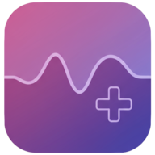
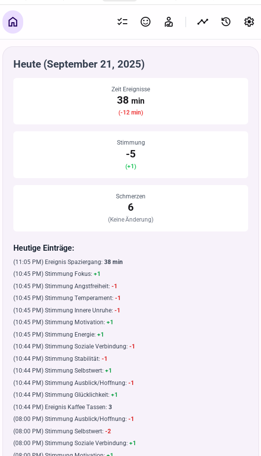
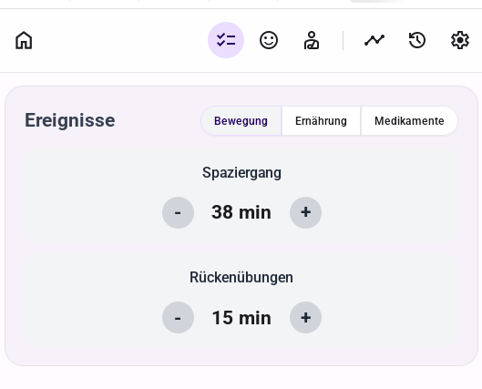
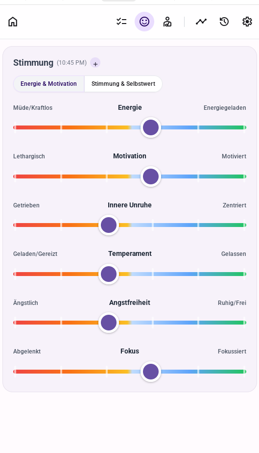
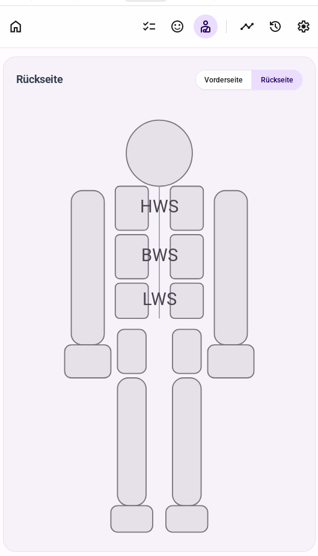
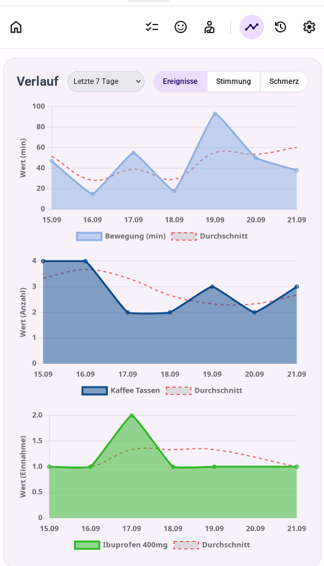
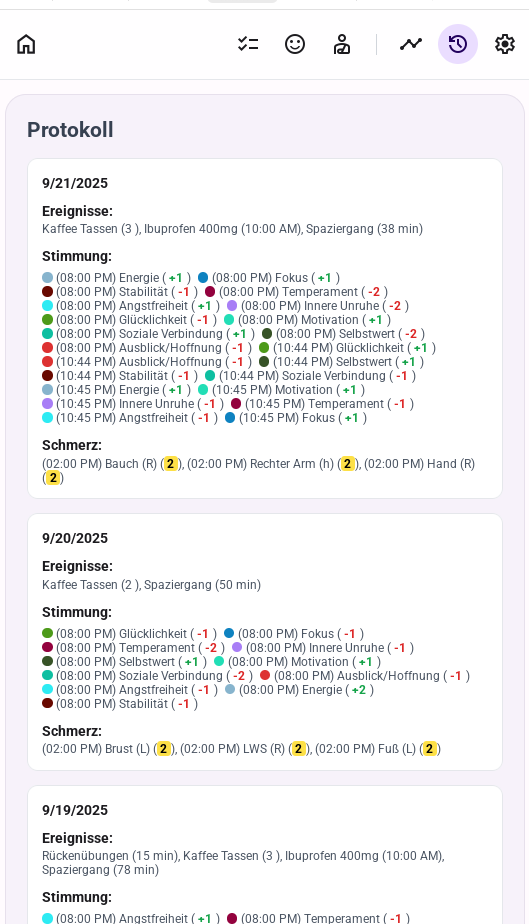
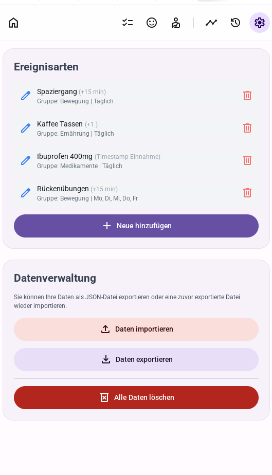

# **WellTrack Gesundheitstagebuch**

WellTrack ist ein persönliches und 100 % privates Gesundheitstagebuch, das dabei hilft, Zusammenhänge zwischen Gewohnheiten, dem eigenen Befinden und der allgemeinen Gesundheit zu erkennen. Als offline-fähige Progressive Web App (PWA) bleiben dabei alle Daten ausschließlich auf dem eigenen Gerät – es gibt keinen Server und keine Cloud. Das ermöglicht vollständige Kontrolle, eine schnelle Nutzung, auch ohne Internetverbindung, auf jedem Gerät.

Diese App ist ein ***Vibecoding - Projekt***. Das bedeutet, sie wurde komplett durch natürliche Sprache mit einer KI erstellt zum Zweck für eine ältere Person eine einfache Möglichkeit zu schaffen ihre täglichen Schmerzen, Stimmungen und Trainingszyklen festzuhalten. Der Code ist nicht oder nur schwer für menschliche Wartung zugänglich. Eine größere Veränderung oder Erweiterung des Codes ist in der momentanen Form nicht empfehlenswert.

## **Funktionen**

### **Tagesübersicht (Dashboard)**

Die Startseite bietet eine Zusammenfassung des aktuellen Tages, einschließlich der Gesamtsummen für Ereignisse, Stimmungen und Schmerzen im Vergleich zum Vortag. Darunter befindet sich ein detailliertes Protokoll aller heutigen Einträge.

### **Ereignisse eintragen**

Protokollieren Sie ganz einfach tägliche Aktivitäten wie Spaziergänge, die Einnahme von Medikamenten oder den Kaffeekonsum. Die Ereignistypen können in den Einstellungen vollständig angepasst werden.

### **Stimmung protokollieren**

Erfassen Sie Ihre Stimmung mithilfe intuitiver Schieberegler für verschiedene Aspekte wie Energie, Motivation und Angstfreiheit. Die Stimmungen sind in Gruppen organisiert, um die Eingabe zu vereinfachen.

### **Schmerzen festhalten**

Auf einer interaktiven Darstellung des menschlichen Körpers können Sie bestimmte Körperteile auswählen und die Schmerzintensität auf einer Skala von 0 bis 5 bewerten.

### **Verlauf & Diagramme**

Visualisieren Sie Ihre gesammelten Daten in übersichtlichen Diagrammen. Analysieren Sie Trends für Ereignisse, Stimmungen und Schmerzen über verschiedene Zeiträume (7, 30 oder 180 Tage).

### **Detailliertes Protokoll**

Ein chronologisches und paginiertes Protokoll aller Einträge, gruppiert nach Tagen, ermöglicht einen tiefen Einblick in Ihre Gesundheitsdaten.

### **Einstellungen & Datenverwaltung**

Passen Sie Ereignisarten an, verwalten Sie Ihre Daten durch Import/Export einer JSON-Datei und konfigurieren Sie Benachrichtigungen.

## **Technische Merkmale**

* **Progressive Web App (PWA):** Kann wie eine native App auf Ihrem Gerät "installiert" werden und funktioniert offline.
* **Single-Page-Anwendung (SPA):** Die gesamte Anwendung wird in einer einzigen HTML-Datei geladen, was eine schnelle und nahtlose Navigation ermöglicht.
* **Lokale Datenspeicherung:** Alle Daten werden sicher im localStorage Ihres Browsers gespeichert. Es ist kein Server oder Backend erforderlich.
* **Responsive UI:** Das mit Tailwind CSS erstellte Layout passt sich an verschiedene Bildschirmgrößen an und ist für Mobilgeräte optimiert.
* **Interaktive Datenvisualisierung:** Diagramme werden mit Chart.js erstellt.
* **Abhängigkeiten über CDN:** Alle externen Bibliotheken (z. B. Tailwind CSS, Chart.js) werden über ein CDN geladen, was die Einrichtung vereinfacht und keine Build-Schritte erfordert.

## **Installation & Nutzung**

1. **Keine Installation erforderlich:** Öffnen Sie einfach die Datei welltrack.html in einem modernen Webbrowser (wie Chrome, Firefox oder Safari).
2. **(Optional) Als App installieren:** Suchen Sie in der Adressleiste Ihres Browsers nach dem Installationssymbol, um WellTrack für einen schnellen Zugriff und eine nahtlose Offline-Nutzung wie eine native App zu Ihrem Startbildschirm hinzuzufügen.
3. **Beginnen Sie mit der Protokollierung:** Nutzen Sie die Navigationssymleiste, um Ihre ersten Einträge zu machen.
